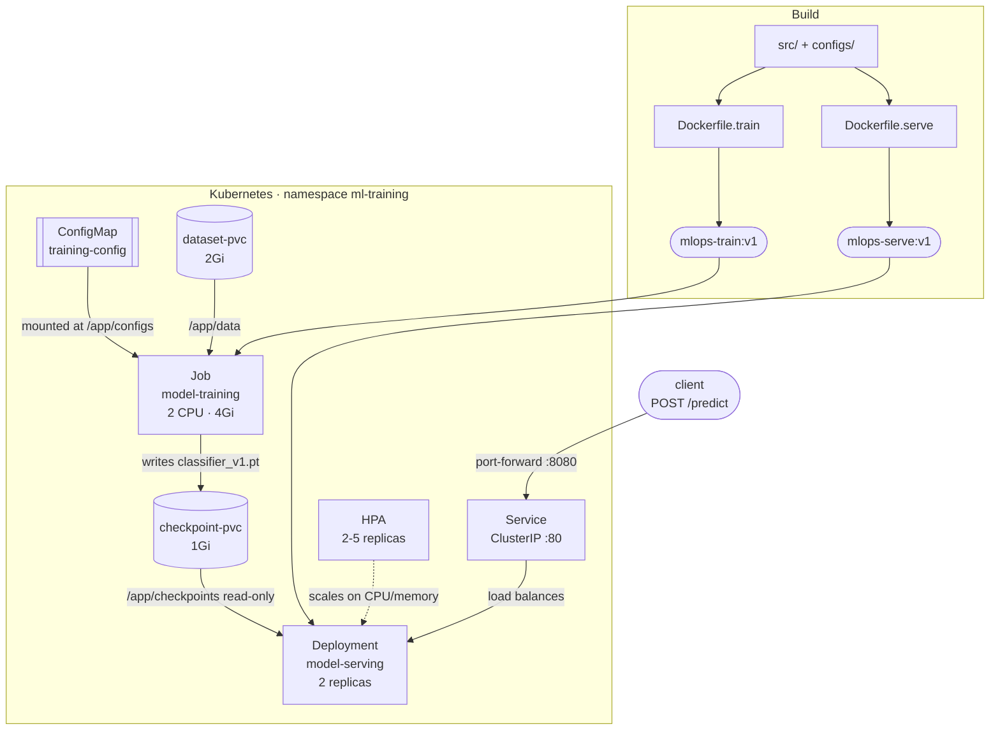

# mlops-pytorch-pipeline

A PyTorch CIFAR-10 classifier taken through the full deployment lifecycle:
containerised training, a FastAPI inference service, and orchestration on
Kubernetes with Jobs, persistent storage, health probes and autoscaling.

IITM MTech · DA5402W MLOps & Infrastructure for Machine Learning · Assignment 2

---

## Architecture



The checkpoint PVC is the handover point: the Job writes the model, the
Deployment mounts it read-only. Serving pods may start before training finishes
— `/health` returns 503 until a checkpoint exists, a `startupProbe` prevents
liveness from killing them in the meantime, and each pod becomes ready by itself
once the file appears.

---

## Layout

```
src/          model.py, dataset.py, train.py, serve.py
configs/      training_config.yaml
docker/       Dockerfile.train, Dockerfile.serve
k8s/          namespace, configmap, pvc, training-job,
              serving-deployment, serving-service, hpa, secret.example
requirements/ train.txt, serve.txt  (all versions pinned)
tests/        test_model.py, test_serve.py  (22 tests)
docs/         PLAN, DECISIONS, RUNBOOK, EVIDENCE, BACKLOG,
              REFLECTION, logs/
```

---

## Quickstart

### Local

```bash
python3 -m venv .venv && source .venv/bin/activate
pip install -r requirements/train.txt -r requirements/serve.txt
pip install pytest httpx ruff

make test
make lint

# short training run — see Configuration below
TRAINING_CONFIG_PATH=configs/training_config.yaml DATA_DIR=./data \
CHECKPOINT_DIR=./checkpoints SUBSET_FRACTION=0.05 MAX_EPOCHS=2 \
python src/train.py

MODEL_CHECKPOINT_PATH=./checkpoints/classifier_v1.pt python src/serve.py
```

API docs at `http://localhost:8080/docs`.

### Docker

```bash
make build

docker run --rm \
  -v "$(pwd)/data:/app/data" \
  -v "$(pwd)/checkpoints:/app/checkpoints" \
  -e SUBSET_FRACTION=0.05 -e MAX_EPOCHS=2 \
  mlops-train:v1

docker run --rm -p 8080:8080 -v "$(pwd)/checkpoints:/app/checkpoints" mlops-serve:v1
curl -X POST localhost:8080/predict -F "image=@test_image.png"
```

Quote the volume paths — this project's directory contains spaces.

### Kubernetes

```bash
minikube start --cpus=4 --memory=7168 --driver=docker
minikube addons enable metrics-server

# build into minikube's own daemon; there is no registry to pull from
eval $(minikube docker-env)
make build

kubectl apply -f k8s/namespace.yaml
kubectl apply -f k8s/configmap.yaml
kubectl apply -f k8s/pvc.yaml
kubectl apply -f k8s/training-job.yaml
kubectl wait --for=condition=complete job/model-training -n ml-training --timeout=3600s

kubectl apply -f k8s/serving-deployment.yaml
kubectl apply -f k8s/serving-service.yaml
kubectl apply -f k8s/hpa.yaml

kubectl get pods -n ml-training
kubectl port-forward svc/model-serving 8080:80 -n ml-training
curl -X POST http://localhost:8080/predict -F "image=@test_image.png"
```

Teardown: `kubectl delete namespace ml-training`

---

## Configuration

`configs/training_config.yaml` holds the baseline and is mirrored by the
ConfigMap. Any value can be overridden per run without editing the file:

| Variable | Overrides |
|---|---|
| `TRAINING_CONFIG_PATH` | Which config file to read |
| `MAX_EPOCHS` | `training.epochs` |
| `BATCH_SIZE` | `training.batch_size` |
| `LEARNING_RATE` | `training.learning_rate` |
| `NUM_WORKERS` | `training.num_workers` |
| `SUBSET_FRACTION` | `data.subset_fraction` |
| `DATA_DIR` | `data.data_dir` |
| `CHECKPOINT_DIR` | `output.checkpoint_dir` |
| `MODEL_CHECKPOINT_PATH` | Checkpoint the serving app loads |

The committed config is the full 10-epoch run. `SUBSET_FRACTION` and
`MAX_EPOCHS` exist so demonstrations finish in minutes.

---

## API

| Endpoint | Purpose |
|---|---|
| `GET /health` | 200 once a checkpoint is loaded, 503 otherwise. Both K8s probes target this |
| `GET /metadata` | Architecture, class names, validation metrics of the loaded checkpoint |
| `POST /predict` | Multipart upload under `image`; returns predicted class, confidence, full distribution |

---

## Measured results

Same image, three environments:

| Environment | Device | Seconds/epoch (2500 images) |
|---|---|---|
| Local virtualenv | `mps` | 4.7 |
| Docker container, all CPUs | `cpu` | 52 |
| Kubernetes Job, 2 CPU limit | `cpu` | 258 |

Metal is unreachable from a Linux container, so every containerised run is
CPU-bound — a 55x spread between the fastest and slowest path for identical
code. Two epochs on 5% of CIFAR-10 reach ~30% validation accuracy against a 10%
chance baseline.

The Docker and Kubernetes runs produced **identical** metrics
(`train_loss: 2.0292`, `val_accuracy: 0.296`), because both used the same seed
and the same `NUM_WORKERS=2`. Results are reproducible across environments for a
fixed worker count.

Images: `mlops-train:v1` 1.39GB, `mlops-serve:v1` 1.43GB. Serving is larger
because both carry PyTorch and serving adds the web stack — it excludes every
training dependency, but PyTorch sets the floor.

---

## Documentation

| File | Contents |
|---|---|
| [PLAN.md](docs/PLAN.md) | Every assignment requirement mapped to the artefact that satisfies it |
| [DECISIONS.md](docs/DECISIONS.md) | 24 decision records with rationale and rejected alternatives |
| [RUNBOOK.md](docs/RUNBOOK.md) | Reproduction steps and a troubleshooting table |
| [EVIDENCE.md](docs/EVIDENCE.md) | Captured verification output per stage |
| [BACKLOG.md](docs/BACKLOG.md) | Known gaps, deviations from the brief, and follow-up work |
| [REFLECTION.md](docs/REFLECTION.md) | Write-up on the hardest parts |
| [logs/](docs/logs/) | Raw terminal captures |

---

## Note on AI assistance

Claude (Anthropic) was used as a development assistant throughout this
assignment — for drafting code and manifests, reviewing designs, and diagnosing
failures. Every commit was written and executed by me, and I can explain any
line in the repository. Where the assistant's initial approach was wrong, the
correction is recorded in `docs/DECISIONS.md` rather than quietly overwritten;
D-009 is the clearest example.
